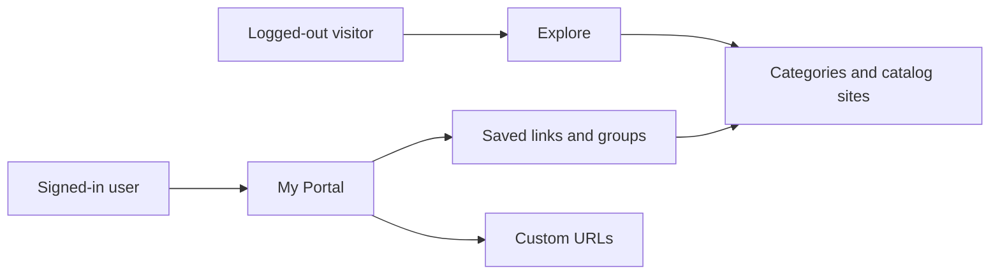

# Protalone — product and implementation plan

Working copy with checklists: [Protalone — Product and Implementation Plan](https://app.notion.com/p/3f42ea02e00081b085e8f5b06aa1c6cf) (private Notion page).

This file is the repo snapshot from 2026-10-09. The GitHub repo stays `portal_one`. The visible product name in this plan is **Protalone**, and can still change to Portal One before the interface copy is widespread.

## Product

Protalone is a personal launchpad.

- **Explore** is a curated catalog of popular websites, grouped so someone can find a site without remembering the address.
- **My Portal** is private. It holds the sites that person commonly visits, in one level of groups, with pins and a keyboard quick-open.

The original request said “command visited website.” This plan reads that as **commonly visited websites**, and puts the same idea in the interface: type a few letters, press Enter, the site opens.

Article clippings and reading notes stay outside this product. Protalone launches websites.

### Who it is for

- The owner, as the first daily user.
- A second signed-in account with a completely separate portal, so multi-user privacy is real before any sharing exists.
- A logged-out visitor who can browse and search the catalog, and is asked to sign in only when saving.

### Principles

- My Portal shows pinned sites immediately. Widgets, themes, and feeds wait.
- The catalog stays curated and small. A few hundred reviewed sites beat an open directory.
- Saving a URL never publishes it to Explore.
- Groups are one level deep: Work, Personal, Learning.
- The first seed includes sites the owner actually opens, including everyday Hong Kong sites. The interface stays English.

## v1 scope

A signed-in person can:

- Browse and search the public catalog by category.
- Save a catalog site into My Portal.
- Paste any `http` or `https` URL and save that exact page.
- Put saves into groups, pin them, reorder them, and delete them.
- Open a saved site and have that open show up in a Recent ordering.
- Jump to a saved site or a catalog site from quick open.

A logged-out person can browse and search Explore. Open on a catalog card is a normal link.

### Done when

- Explore lists at least 100 published sites across the categories below, and search works.
- A new account can save 10 catalog sites and 3 custom URLs, place them in at least 2 groups, pin 5, and reopen them on a phone-width screen and on a desktop.
- A second account cannot read or edit the first account’s groups or saves.
- Adding a popular site is a change to `catalog/catalog.json` plus an import command. v1 has no admin website.
- The owner has started from My Portal for one real week and written down what felt slow.

### Later

Ship these only after that week of use:

- Browser bookmark import (do this first; it fills My Portal from a list people already have)
- New-tab extension that shows pins
- Drag-and-drop reorder, if up and down controls feel clumsy
- A public read-only link for one group
- A submission queue for the public catalog
- Notes, feeds, widgets, themes, teams, comments, and follows
- Ads, charging, or a paid tier
- Syncing a saved title when the catalog title changes
- A full internationalization framework

## Experience

| Route | Who | Behavior |
| --- | --- | --- |
| `/` | Everyone | Signed-out people land on Explore. Signed-in people land on My Portal. |
| `/explore` | Everyone | Category chips, search, site cards. `category` and `q` stay in the query string. |
| `/portal` | Signed in | Pins, groups, ungrouped saves, add-link form, quick open. |
| `/signin` | Signed out | Email magic link. Add Google only if it does not delay the first deploy. |
| `/go/[savedLinkId]` | Owner of that save | Records the open, then redirects to the saved URL. |

### Explore

Each card shows a favicon, name, host, one-sentence description, Open, and Save. Save sends a signed-out visitor through sign-in and back to the same search.

Search matches name and host, case-insensitive, at most 50 hits. If the query looks like a URL and nothing matches, offer to add that URL to My Portal.

### My Portal

1. Quick open. Saves match first, then catalog sites. Enter opens the highlighted row. A catalog row has a separate save action.
2. Pinned. Pin is a flag. The save also stays in its group.
3. Groups, in manual order. Rename, move, and delete. Deleting a group moves its saves to Ungrouped.
4. Ungrouped.
5. Add link. Optional title. If the host matches one catalog site, show that entry as a hint. The pasted URL still saves, so a specific repository page stays that page.

Empty state: “Save a few sites you open every day,” with Explore and paste-a-URL.

Manual order is the v1 default inside a group. Recent is a separate view sorted by `last_opened_at`.

### Opens

Signed-out Open on a catalog card is a direct link with `rel="noopener"`. There is no public click log.

Open on a saved link goes through `/go/[id]`, increments `open_count`, sets `last_opened_at`, and redirects. That history belongs to the owner and only covers links they saved.

## Data model



`categories`: `id`, unique `slug`, `name`, `sort_order`.

`catalog_sites`: `id`, `category_id`, `name`, `url`, `host`, `description`, `sort_order`, `featured`. Public read. The browser cannot write these. The import script uses the service role.

`groups`: `id`, `user_id`, `name`, `sort_order`, `created_at`. One level. Names need not be unique.

`saved_links`: `id`, `user_id`, nullable `catalog_site_id`, nullable `group_id`, `title`, `url`, `normalized_url`, `pinned`, `sort_order`, `open_count`, `last_opened_at`, `created_at`. Unique on `(user_id, normalized_url)`. If the catalog row is removed, the save remains and `catalog_site_id` becomes null.

Supabase Auth owns identity. v1 has no profile table.

### URL rules

Normalize before the uniqueness check:

- Accept only `http` and `https`.
- Lowercase the scheme and host.
- Drop the fragment and default ports.
- Drop `utm_source`, `utm_medium`, `utm_campaign`, `utm_term`, `utm_content`, `utm_id`, `fbclid`, `gclid`, `mc_cid`, and `mc_eid`.
- Drop a trailing slash unless the URL is only an origin.
- Keep the path and the remaining query.

If that normalized URL is already saved, focus the existing card.

### Favicons

Use a public favicon image keyed by hostname, for example `https://www.google.com/s2/favicons?domain=HOST&sz=64`. The app server does not fetch the user’s URL.

### Seed categories

About 8 to 12 sites each, in `catalog/catalog.json`:

1. Search and AI
2. Mail and calendar
3. Social
4. Video and music
5. News
6. Shopping
7. Finance
8. Developer
9. Docs and cloud
10. Learning
11. Life admin
12. Hong Kong

Each row has `name`, `url`, `description`, and a category slug. Write the first list from sites you already open.

## Technical approach

- Next.js App Router and TypeScript
- Tailwind CSS
- Supabase for Postgres and Auth
- Vercel for hosting
- Server Components for Explore and My Portal
- Server Actions for save, group, pin, reorder, and delete
- No client state library in v1

Catalog search is SQL `ilike` on name and host. Add an index when the catalog grows past a few thousand rows.

```sql
create table categories (
  id uuid primary key default gen_random_uuid(),
  slug text unique not null,
  name text not null,
  sort_order int not null
);

create table catalog_sites (
  id uuid primary key default gen_random_uuid(),
  category_id uuid not null references categories(id),
  name text not null,
  url text not null,
  host text not null,
  description text not null,
  sort_order int not null,
  featured boolean not null default false
);

create table groups (
  id uuid primary key default gen_random_uuid(),
  user_id uuid not null references auth.users(id) on delete cascade,
  name text not null,
  sort_order int not null,
  created_at timestamptz not null default now()
);

create table saved_links (
  id uuid primary key default gen_random_uuid(),
  user_id uuid not null references auth.users(id) on delete cascade,
  catalog_site_id uuid references catalog_sites(id) on delete set null,
  group_id uuid references groups(id) on delete set null,
  title text not null,
  url text not null,
  normalized_url text not null,
  pinned boolean not null default false,
  sort_order int not null,
  open_count int not null default 0,
  last_opened_at timestamptz,
  created_at timestamptz not null default now(),
  unique (user_id, normalized_url)
);
```

Enable row level security on `groups` and `saved_links`. Each policy allows `auth.uid() = user_id` for all operations, with the same expression in `with check`.

`categories` and `catalog_sites` are readable by the anonymous role and have no browser write policy.

```text
app/
  explore/
  portal/
  signin/
  go/[savedLinkId]/
catalog/catalog.json
lib/url.ts
supabase/migrations/
scripts/import-catalog.ts
```

### Tests

- URL normalization: tracking params, trailing slash, host case, rejected `javascript:` URLs.
- A second save of the same normalized URL returns the existing row.
- User B cannot select or update user A’s saves.
- Manual pass: signed-out explore, save, group, pin, quick open, phone-width layout.

## Security and privacy

- Store addresses, not passwords for other websites.
- Reject non-http(s) URLs, including `javascript:` and `data:`.
- Do not fetch saved URLs on the server in v1.
- Favicon requests use a fixed host and the parsed hostname.
- `/go/[id]` checks ownership and returns 404 otherwise.
- Redirect targets are the stored `http` or `https` URL only.

## Build order

Phases are sequential. Sizes are relative effort for a solo build.

### Phase 0 — Frame and seed

Depends on nothing. Size: small.

- Choose the public display name: Protalone or Portal One.
- Create the Supabase project and a Vercel project. Keep secrets in environment variables.
- Write `catalog/catalog.json` with the 12 categories and at least 100 sites.
- Lock URL normalization in `lib/url.ts` before any saves exist.

### Phase 1 — Walking skeleton

Depends on Phase 0 accounts. Size: medium.

- Next.js, TypeScript, Tailwind, and lint.
- Email magic-link sign-in and sign-out.
- Public `/explore` with a handful of placeholder cards.
- Signed-in `/portal` empty state.
- A preview deployment.

### Phase 2 — Catalog

Depends on Phase 1. Size: medium.

- Migration for `categories` and `catalog_sites`.
- Idempotent import from `catalog/catalog.json`.
- Category filter, search, and direct Open.
- Empty search state, including the add-URL prompt.

### Phase 3 — Personal library

Depends on Phase 2. Size: medium to large.

- Migration for `groups` and `saved_links`, plus owner row-level security.
- Save a catalog site and add a custom URL.
- Create, rename, reorder, and delete a group.
- Move, pin, unpin, reorder, and delete a save.
- My Portal renders pins, groups, and ungrouped.
- Two-account access check.

### Phase 4 — Daily use

Depends on Phase 3. Size: medium.

- Favicons, quick open, and `/go/[savedLinkId]`.
- Recent view.
- Loading, error, and empty states.
- Phone-width pass.

### Phase 5 — Ship v1

Depends on Phase 4. Size: small.

- Production domain and auth redirect URLs.
- README with local run steps and the import command.
- The tests above.
- One week of personal use, with friction written back on the Notion plan.

### Phase 6 — After it is a habit

Pick one: bookmark import, a read-only shared group, or a new-tab extension.

## Risks

| Risk | What happens | Response |
| --- | --- | --- |
| The product grows into a widget start page | The first usable portal slips | Phase 6 starts after a week of real use |
| The catalog goes stale | Search returns dead products | Keep the seed small and skip public submissions in v1 |
| Auth and hosting consume the first sessions | Nothing is usable yet | Phase 1 ends at a deployed empty portal and one auth method |
| Browser bookmarks feel sufficient | The portal goes unused | Pins above the fold, quick open, and a seed of real daily sites |
| The server fetches user URLs | Scraping is slow and can reach internal addresses | v1 does not fetch the URL |

## How to tell v1 worked

- You start at My Portal on most days for a week for the sites you used to open from bookmarks.
- You paste a new site and you find an old favorite through Explore.
- A second account has its own list, and a database check shows no cross-read.

When other people show up, watch how many save at least 5 links and how many return the next week. Host logs are enough until then.

## Decisions

| Topic | Default | Why |
| --- | --- | --- |
| Display name | Protalone; repo stays `portal_one` | Matches the request and is easy to rename in the interface |
| Stack | Next.js, Supabase, Vercel | Auth, Postgres, and previews without a custom server |
| Catalog edits | `catalog/catalog.json` in git | Ships the directory before an admin UI |
| Grouping | One level | Separates Work and Personal without a tree |
| Open history | Saved links only, owner only | Supports Recent while Explore stays untracked |
| First auth method | Email magic link | No password store to build |

Change a row before Phase 1 code depends on it. After saves exist, keep URL normalization and the uniqueness rule stable.
